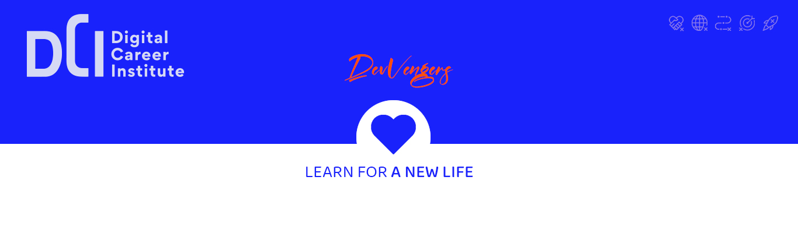

# Welcome to DCI GitHub Organization
---

## About Digital Career Institute

Digital Career Institute (DCI) is a vibrant learning community dedicated to empowering individuals with digital skills and fostering innovation in technology. We provide comprehensive and hands-on training programs to equip our students with the knowledge and expertise needed for successful careers in the digital world.

## Code of Conduct

At DCI, we believe in creating an inclusive and respectful learning environment. We expect all members of our community, including students, instructors, and staff, to adhere to our code of conduct. Be kind, be respectful, and be collaborative. Harassment and discrimination of any kind will not be tolerated.

## Class Content (Modules)

### 1. Basic Digital Literacy

- Fundamentals: Introduction to Web Development, Terminal Usage, and Github Basics.

### 2. User Interface Basics

- HTML Basics: Fundamental HTML Structure, Box Model, UI/UX Principles.
- Advanced UI/UX: Data Handling, Responsiveness, Layout Design, User Interactions.
- Frameworks: Introduction to UI Frameworks, Publishing Websites.

### 3. Programming Basics

- Basics of JavaScript Language: Syntax, Variables, Data Types.
- Programming Concepts: Control Structures, Functions, Error Handling.
- Object-Oriented Programming: Objects, Classes, Inheritance, Polymorphism.

### 4. Single Page Application

- Document Object Model (DOM): Manipulating Web Pages Dynamically.
- JavaScript Modules: Organizing Code, Asynchronous Programming.
- React Applications: Building Interactive User Interfaces with React.

### 5. Backend Development

- Server-Side Applications: Creating Backend Services, APIs.
- Databases: Introduction to Databases, Database Management Systems.
- Security: Web Security Best Practices.
- Deployment: Deploying Full Stack Applications.

We are excited to have you on this learning journey with us. Together, we will explore the fascinating world of digital technology and create a future filled with innovation and opportunities.

Happy coding!

*The Digital Career Institute Team*

<!--

**Here are some ideas to get you started:**

🙋‍♀️ A short introduction - what is your organization all about?
🌈 Contribution guidelines - how can the community get involved?
👩‍💻 Useful resources - where can the community find your docs? Is there anything else the community should know?
🍿 Fun facts - what does your team eat for breakfast?
🧙 Remember, you can do mighty things with the power of [Markdown](https://docs.github.com/github/writing-on-github/getting-started-with-writing-and-formatting-on-github/basic-writing-and-formatting-syntax)
-->
